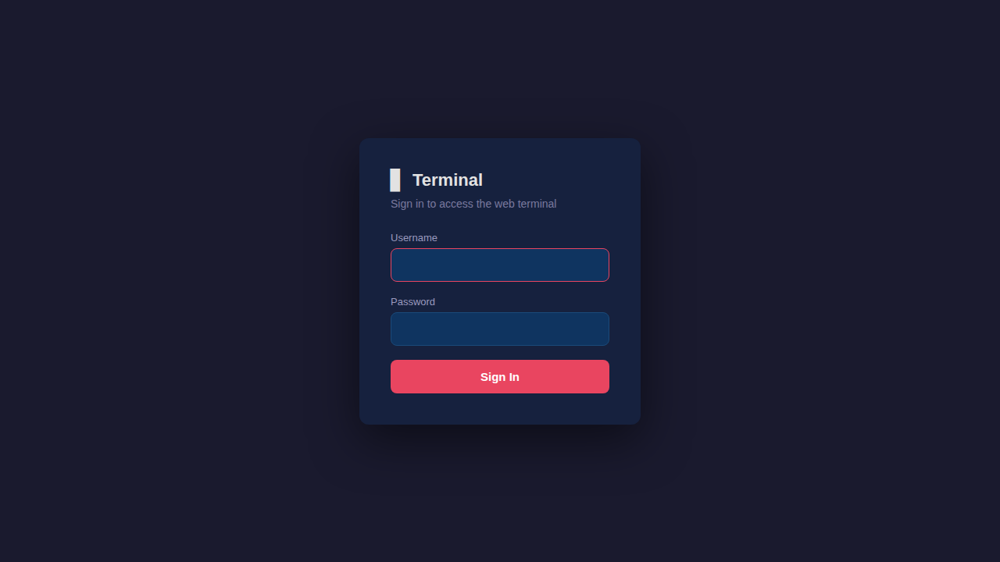
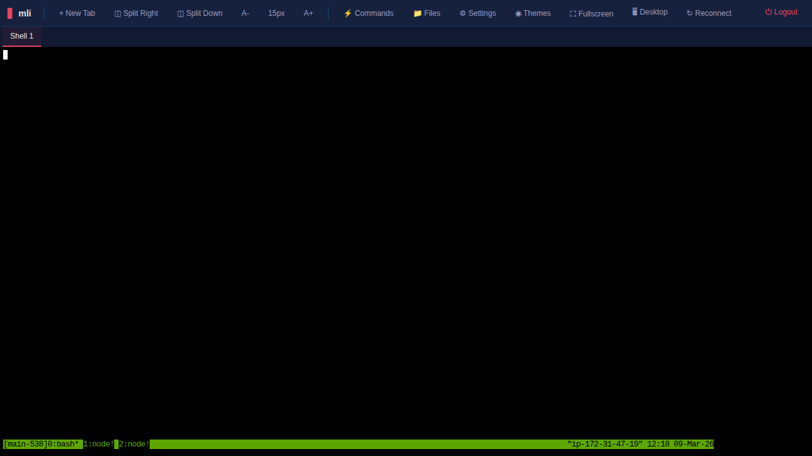
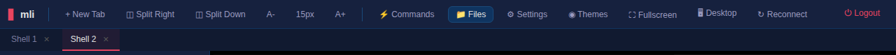
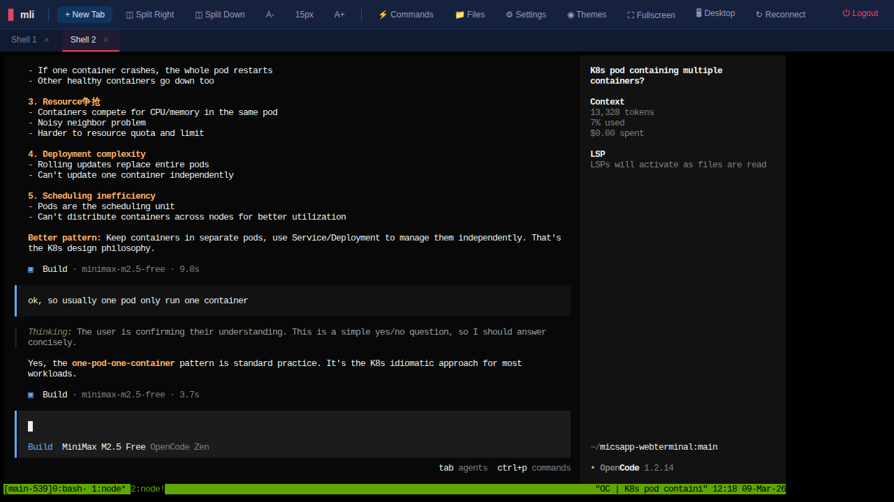
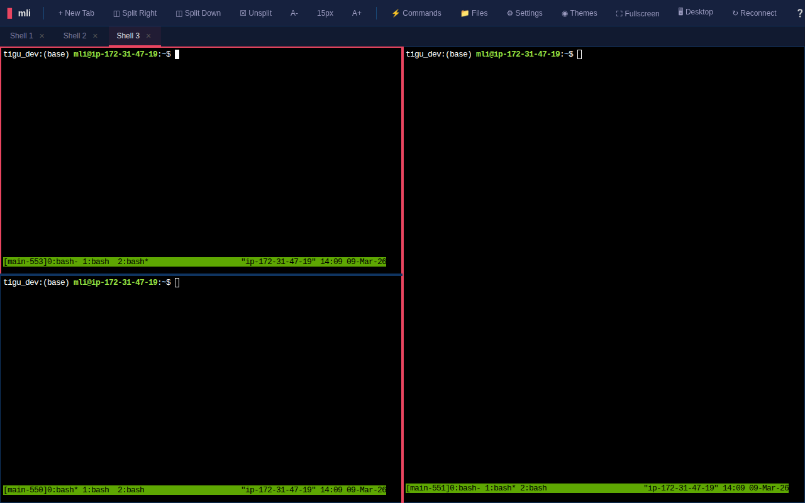
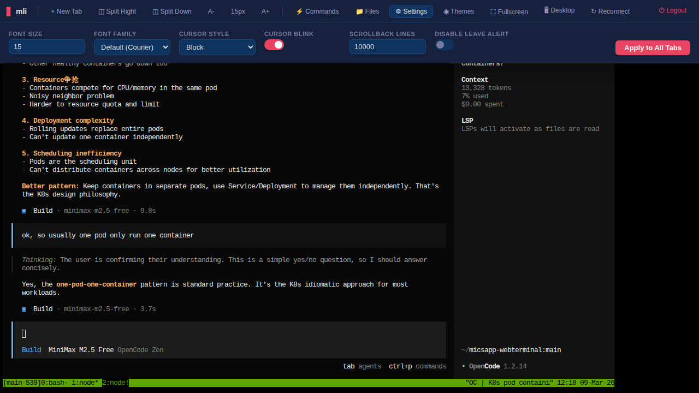
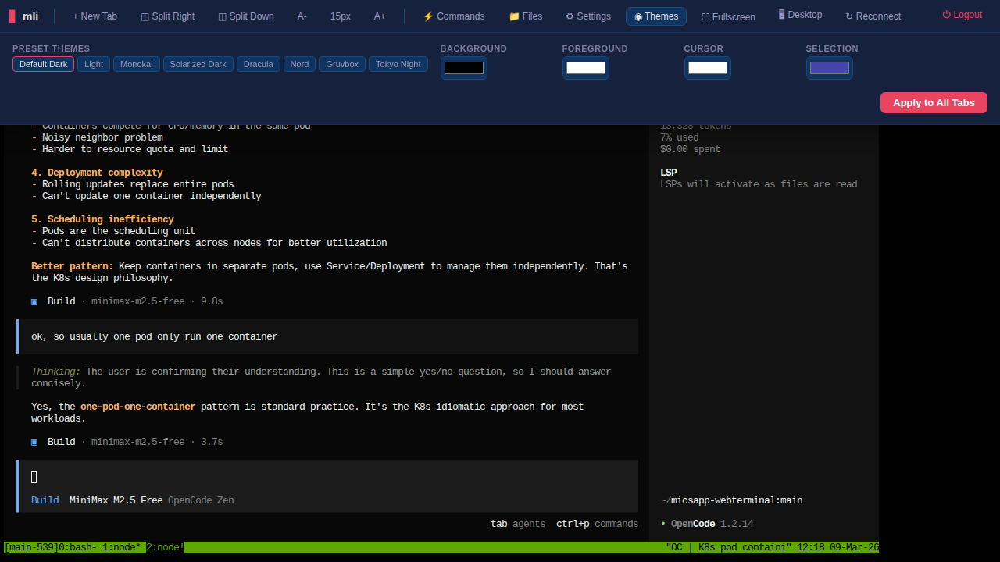
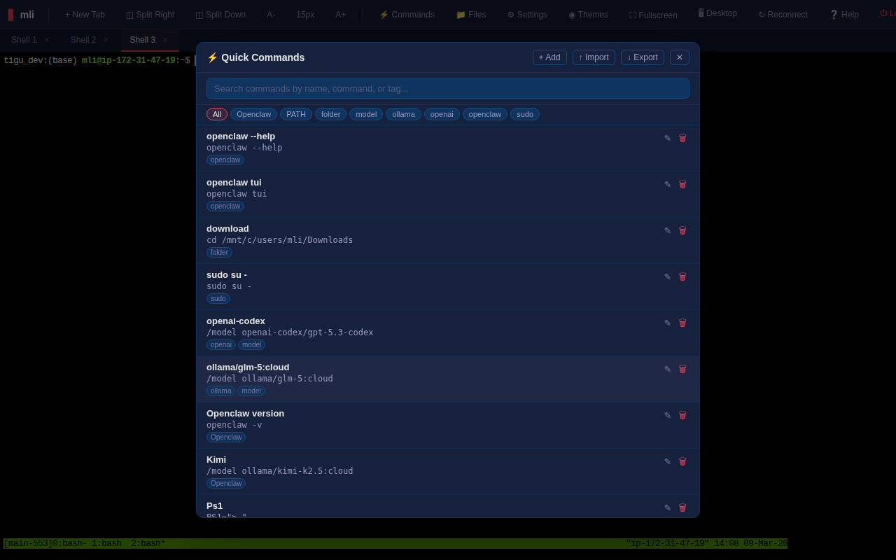
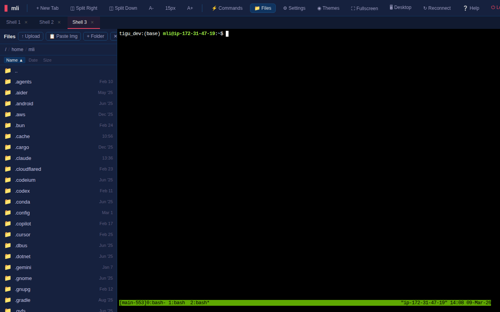
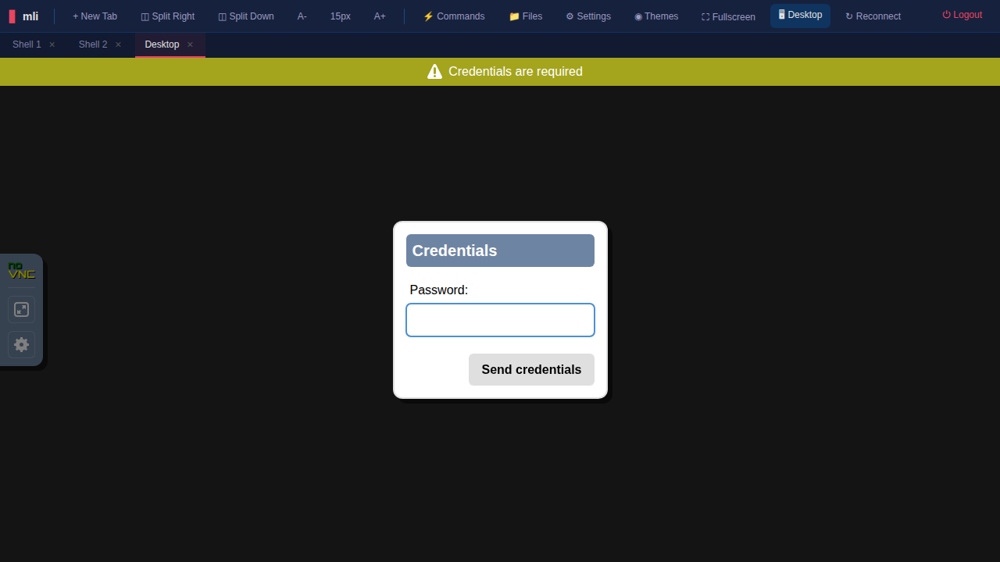

# Web Terminal User Manual

A browser-based multi-tenant terminal with file management, split panes, themes, and remote desktop access.

---

## Login

Enter your username and password to sign in. Each user gets an isolated shell session running under their own system account.



---

## Main Interface

After login you land on the terminal with a toolbar at the top and a tab bar below it.



### Toolbar

The toolbar provides quick access to all features:



| Button | Description |
|--------|-------------|
| **+ New Tab** | Open a new terminal tab |
| **Split Right / Split Down** | Split the view into side-by-side or stacked panes |
| **A- / A+** | Decrease / increase font size (current size shown between them) |
| **Commands** | Open the quick commands library |
| **Files** | Toggle the file browser sidebar |
| **Settings** | Terminal settings (font, cursor, scrollback) |
| **Themes** | Color theme picker |
| **Fullscreen** | Enter browser fullscreen mode |
| **Desktop** | Open a remote desktop (VNC) tab |
| **Reconnect** | Reconnect the current terminal session |
| **Logout** | Sign out and return to the login page |

On mobile devices, overflow buttons collapse into a hamburger menu.

---

## Tabs

Each tab is an independent terminal session backed by a tmux window. Your tabs persist across page reloads.



- **New Tab** -- click **+ New Tab** or press `Ctrl+Shift+T`
- **Switch Tab** -- click a tab name
- **Rename Tab** -- double-click the tab name and type a new name
- **Close Tab** -- click the **x** button or press `Ctrl+Shift+W`

Tabs are backed by tmux grouped sessions. Closing a tab detaches the tmux client but the underlying tmux window and its processes keep running. Reopening or reconnecting reattaches to the same window.

---

## Split Panes

Split the terminal view to see two sessions side by side.



| Action | Button | Shortcut |
|--------|--------|----------|
| Split horizontally | **Split Right** | `Ctrl+Shift+\` |
| Split vertically | **Split Down** | `Ctrl+Shift+-` |
| Close split | **Unsplit** | `Ctrl+Shift+U` |

Each pane shows a different tab. Click a pane to focus it, then use the tab bar to change which session is displayed. You can drag the divider to resize panes.

---

## Settings

Click **Settings** in the toolbar to configure the terminal.



| Setting | Options | Default |
|---------|---------|---------|
| **Font Size** | 8 -- 36 px | 15 px |
| **Font Family** | Courier, Menlo, Monaco, Consolas, Ubuntu Mono, and more | Courier |
| **Cursor Style** | Block, Underline, Bar | Block |
| **Cursor Blink** | On / Off | On |
| **Scrollback Lines** | 100 -- 100,000 | 10,000 |
| **Disable Leave Alert** | On / Off | Off |

Click **Apply to All Tabs** to push changes to every open terminal. Settings are saved in your browser and restored on next visit.

The **A-** and **A+** buttons in the toolbar provide quick font size adjustment without opening the settings panel.

---

## Themes

Click **Themes** to choose a color scheme.



### Preset Themes

Default Dark, Light, Monokai, Solarized Dark, Dracula, Nord, Gruvbox, Tokyo Night

### Custom Colors

Use the color pickers to override individual colors:
- **Background** -- terminal background
- **Foreground** -- default text color
- **Cursor** -- cursor color
- **Selection** -- text selection highlight

Click **Apply to All Tabs** to apply your theme everywhere.

---

## Quick Commands

Click **Commands** to open a library of saved terminal commands you can run with one click.



- **Search** -- type to filter commands by name, text, or tag
- **Tags** -- click a tag chip to filter by category
- **Run** -- click any command to send it to the active terminal
- **Add** -- create a new command with a name, command text, and tags
- **Edit / Delete** -- manage existing commands

Commands are stored server-side and shared across sessions.

---

## File Browser

Click **Files** to open the file browser sidebar on the left.



### Navigation

- Click a folder to enter it
- Click **..** to go up one level
- Click the breadcrumb path segments at the top to jump to a parent directory
- Double-click the breadcrumb bar to type a path directly

### File Operations

| Action | How |
|--------|-----|
| **Upload** | Click **+ Upload** or drag-and-drop files onto the sidebar |
| **Paste Image** | Click **Paste Img** to paste an image from clipboard |
| **New Folder** | Click **+ Folder** |
| **Download** | Click a file to preview, then use the download button |
| **Rename** | Right-click or use the context action on a file |
| **Delete** | Right-click or use the context action (with confirmation) |

### File Preview

Clicking a file opens a preview modal:
- **Text files** -- displayed with syntax highlighting; editable inline
- **Markdown** (`.md`) -- rendered as formatted HTML with a toggle to view source
- **Images** -- displayed in the modal
- **Video / Audio** -- embedded player
- **PDF** -- embedded viewer

### Sorting

Click the column headers (**Name**, **Date**, **Size**) to sort the file listing.

---

## Remote Desktop (VNC)

Click **Desktop** in the toolbar to open a graphical desktop session via noVNC.



The desktop runs in a dedicated tab. It connects to the server's VNC display through a websocket proxy. Use the noVNC controls on the left edge to toggle the sidebar, enter fullscreen, or adjust settings.

---

## Keyboard Shortcuts

| Shortcut | Action |
|----------|--------|
| `Ctrl+Shift+T` | New Tab |
| `Ctrl+Shift+W` | Close Tab |
| `Ctrl+Shift+]` | Next Tab |
| `Ctrl+Shift+[` | Previous Tab |
| `Ctrl+Shift+E` | Toggle File Browser |
| `Ctrl+Shift+\` | Split Right |
| `Ctrl+Shift+-` | Split Down |
| `Ctrl+Shift+U` | Unsplit |

---

## Mobile Support

On smaller screens the interface adapts automatically:

- Toolbar buttons collapse into a **hamburger menu** (three-line icon)
- A **special keys bar** appears at the bottom with touch-friendly buttons for Ctrl, Shift, Alt, Tab, Enter, Delete, and arrow keys
- Long-press to select terminal text; a copy modal provides reliable clipboard access
- Split panes are disabled below 768px width

---

## API Tokens

The Settings panel includes an **API Tokens** section at the bottom for creating bearer tokens that allow programmatic (non-browser) access to the HTTP API.

### Creating a Token

1. Open **Settings** in the toolbar
2. Scroll to the **API Tokens** section
3. Click **+ New Token** and enter a descriptive name (e.g. "ci-bot", "laptop")
4. Copy the token immediately -- it is shown only once

### Using a Token

Pass the token in an `Authorization` header:

```
Authorization: Bearer <your-token>
```

Tokens authenticate the same API endpoints as a browser session (file operations, quick commands, etc.) but cannot access terminal WebSocket connections (`/ut/...`).

### Revoking a Token

Click **Revoke** next to any token in the Settings panel to permanently delete it.

---

## Shell Command Execution (`/api/exec`)

The `/api/exec` endpoint lets you run shell commands remotely and receive structured output. Requires a session cookie or bearer token.

### Request

```bash
curl -X POST https://host/api/exec \
  -H "Authorization: Bearer <token>" \
  -H "Content-Type: application/json" \
  -d '{"command": "ls -la /tmp"}'
```

| Field | Required | Default | Description |
|-------|----------|---------|-------------|
| `command` | Yes | -- | Shell command to run (via `bash -c`) |
| `timeout` | No | 30 | Max seconds to wait (1--300) |
| `cwd` | No | User's home | Working directory |
| `stdin` | No | -- | String piped to stdin |

Request body is limited to 64 KB.

### Response

```json
{
  "stdout": "...",
  "stderr": "...",
  "exit_code": 0
}
```

Stdout and stderr are each capped at 512 KB. Commands that exceed the timeout return HTTP 408.

---

## Tips

- **Session persistence** -- your shell processes run inside tmux. Even if you close the browser, processes keep running. Reopen the same tabs to reconnect.
- **Clipboard** -- iframes have clipboard API access. Copy/paste should work natively. On mobile, use the copy modal for reliable results.
- **Reconnect** -- if a terminal goes blank or disconnects, click **Reconnect** to reattach without losing your tmux session.
- **Fullscreen** -- press the **Fullscreen** button for a distraction-free terminal experience.
