# Web Terminal — Architecture Wiki

> **Author:** Solution Architecture Team  
> **Last Updated:** March 2026  
> **Audience:** Engineers, DevOps, Security Reviewers

---

## Table of Contents

1. [Executive Summary](#1-executive-summary)
2. [High-Level System Architecture](#2-high-level-system-architecture)
3. [Network Topology & Traffic Flow](#3-network-topology--traffic-flow)
4. [Request Lifecycle](#4-request-lifecycle)
5. [Authentication & Session Management](#5-authentication--session-management)
6. [Per-User Terminal Isolation](#6-per-user-terminal-isolation)
7. [Reverse Proxy & Routing Layer](#7-reverse-proxy--routing-layer)
8. [Frontend SPA Architecture](#8-frontend-spa-architecture)
9. [File Browser Subsystem](#9-file-browser-subsystem)
10. [Security Architecture](#10-security-architecture)
11. [Deployment & Operations](#11-deployment--operations)
12. [Data Persistence Model](#12-data-persistence-model)
13. [Cross-Cutting Concerns](#13-cross-cutting-concerns)

---

## 1. Executive Summary

micsapp-webterminal is a **browser-based, multi-tenant terminal system** that provides isolated shell access to Linux/macOS system users over the internet. It requires **zero client-side software** — only a modern web browser.

**Key Design Decisions:**

| Decision | Rationale |
|----------|-----------|
| Cloudflare Tunnel (outbound-only) | Zero open ports, no VPN, no firewall rules |
| System PAM auth via SSH | Leverage existing user accounts — no separate user database |
| Python stdlib only (no pip deps) | Minimal attack surface, instant cold start, no dependency management |
| Embedded SPA in Python (no build step) | Single-file deployment, no Node.js/npm required on server |
| Per-user ttyd + tmux | OS-level UID isolation, session persistence across disconnects |

---

## 2. High-Level System Architecture

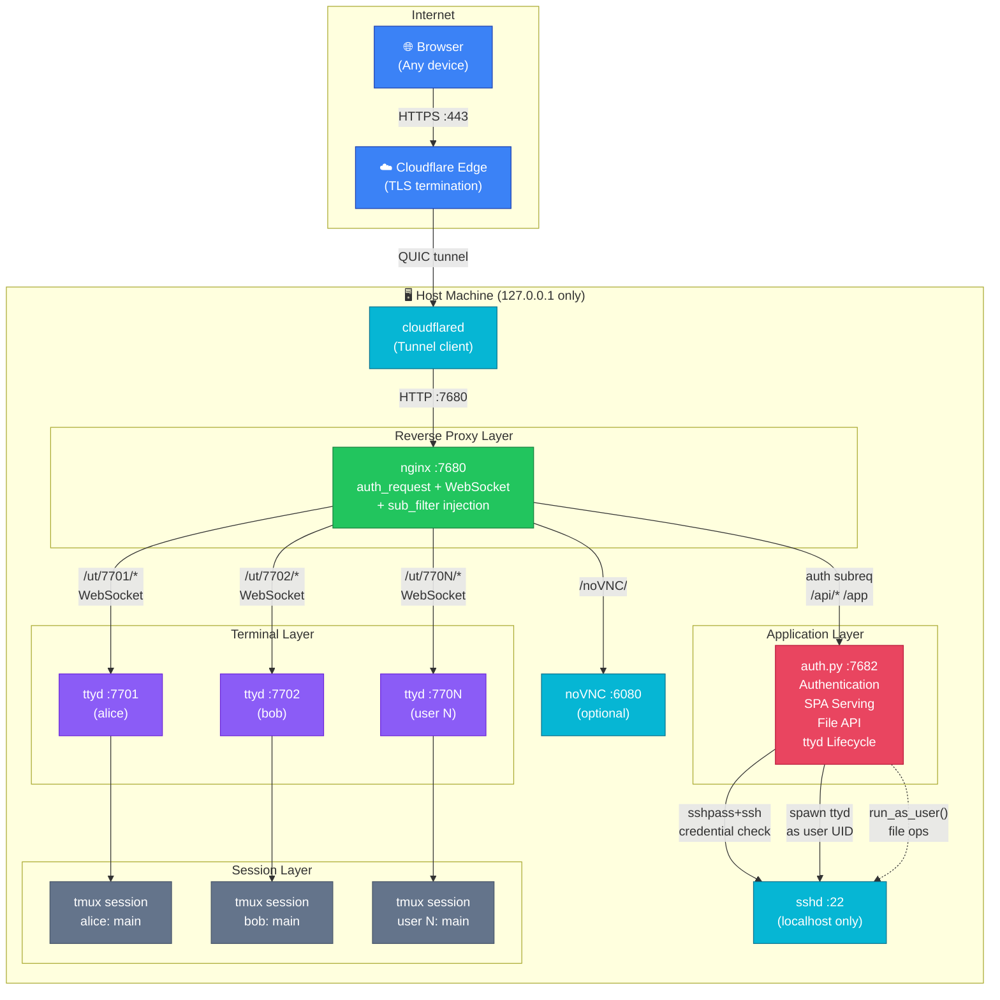

### Component Inventory

| Component | Technology | Binding | Purpose |
|-----------|------------|---------|---------|
| **cloudflared** | Go binary | Outbound QUIC | Encrypted tunnel to Cloudflare edge |
| **nginx** | C (modules) | 127.0.0.1:7680 | Reverse proxy, auth gating, WebSocket upgrade, JS injection |
| **auth.py** | Python 3 stdlib | 127.0.0.1:7682 | Auth, SPA serving, file API, ttyd lifecycle |
| **ttyd** | C + xterm.js | 127.0.0.1:7700+ | Per-user WebSocket terminal emulator |
| **tmux** | C | — | Session multiplexer, process persistence |
| **sshd** | OpenSSH | 127.0.0.1:22 | PAM auth, UID isolation for spawning |
| **noVNC** | JS + Python | 127.0.0.1:6080 | Optional browser-based VNC |

---

## 3. Network Topology & Traffic Flow

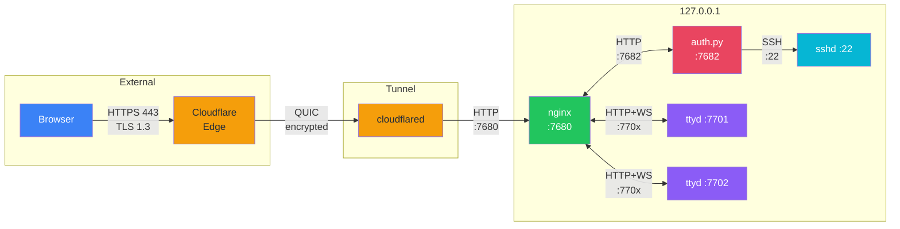

**Key Network Properties:**

- **Zero open inbound ports** — `cloudflared` initiates 4 outbound QUIC connections
- **All services bind `127.0.0.1`** — unreachable from LAN or internet directly
- **No VPN or SSH tunnel required** by end users — browser-only access
- **TLS terminated at Cloudflare edge** — HTTPS between browser and Cloudflare; QUIC between Cloudflare and host

---

## 4. Request Lifecycle

### 4.1 Login Flow

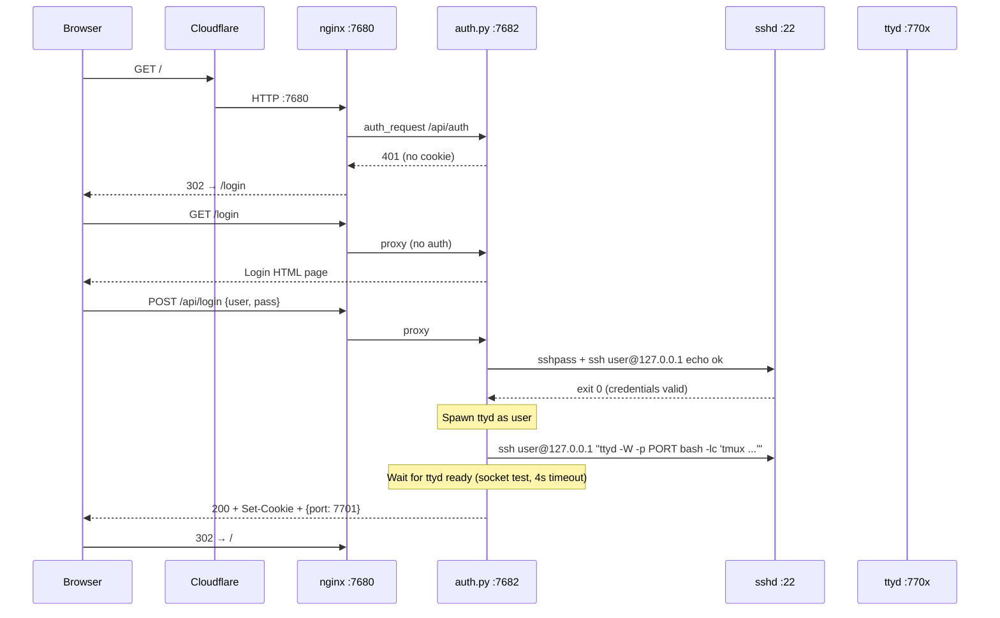

### 4.2 Authenticated SPA + Terminal

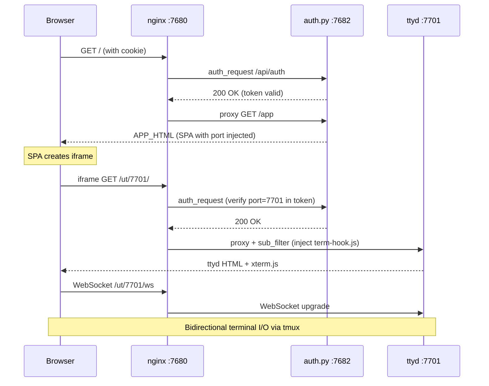

### 4.3 File Operations

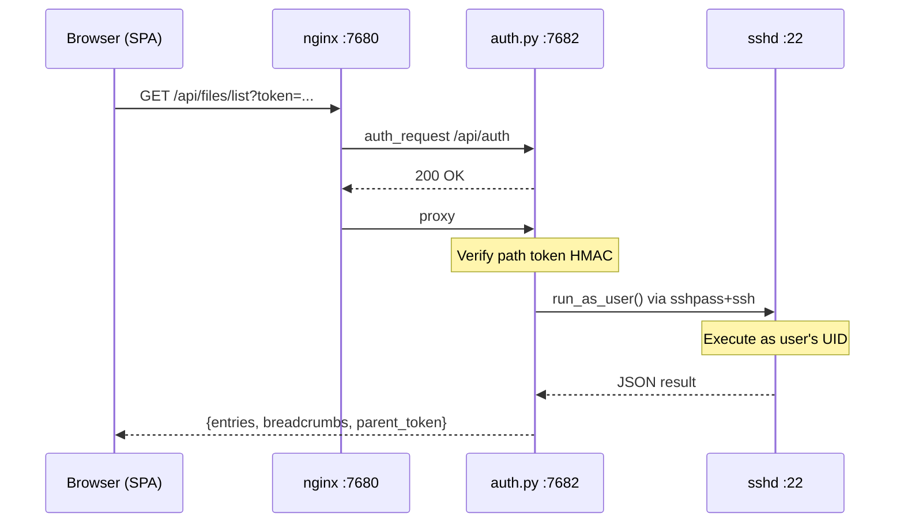

---

## 5. Authentication & Session Management

### 5.1 Token Architecture

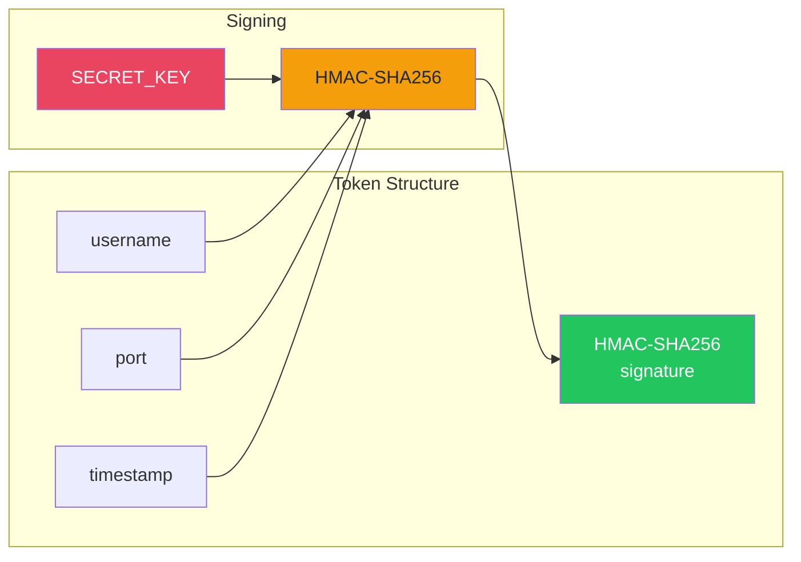

**Token format:** `username:port:timestamp:HMAC-SHA256(key, "username:port:timestamp")`

### 5.2 Cookie Properties

| Attribute | Value | Purpose |
|-----------|-------|---------|
| `Name` | `__Host-ttyd_session` | `__Host-` prefix enforces Secure + no Domain + Path=/ |
| `HttpOnly` | Yes | Inaccessible to JavaScript (XSS mitigation) |
| `Secure` | Yes | HTTPS only |
| `SameSite` | Strict | No cross-site transmission (CSRF mitigation) |
| `Max-Age` | 86400 | 24h expiry (configurable) |

### 5.3 Auth Verification Pipeline

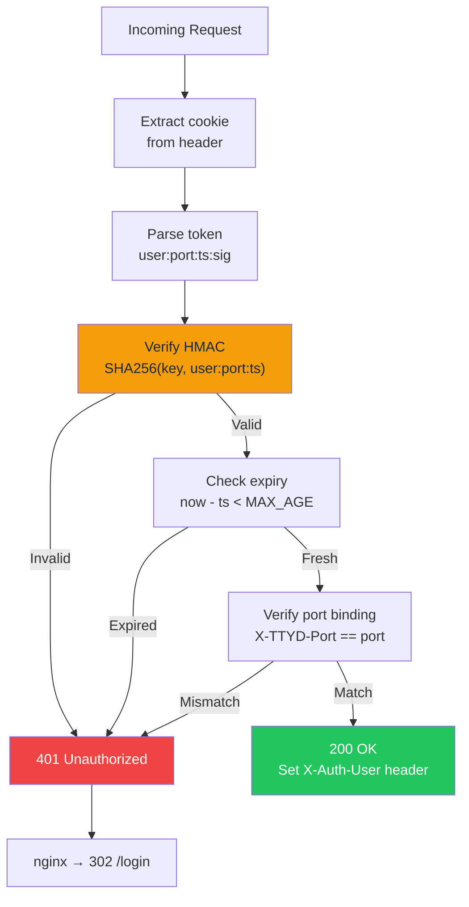

**Port binding check:** When a request hits `/ut/7701/...`, nginx sets `X-TTYD-Port: 7701` in the auth subrequest. auth.py verifies that the token's port matches. This prevents User A from accessing User B's ttyd port.

---

## 6. Per-User Terminal Isolation

### 6.1 Isolation Model

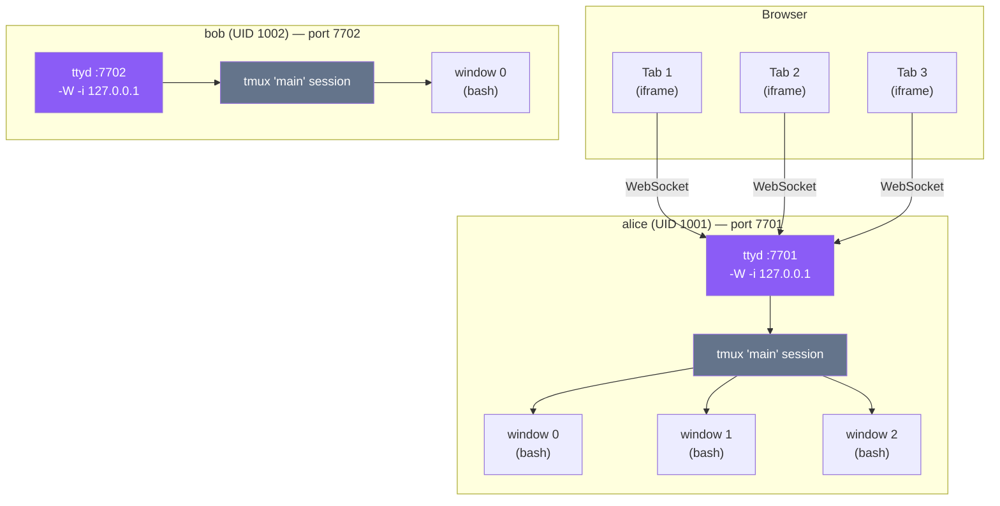

### 6.2 ttyd Spawning Sequence

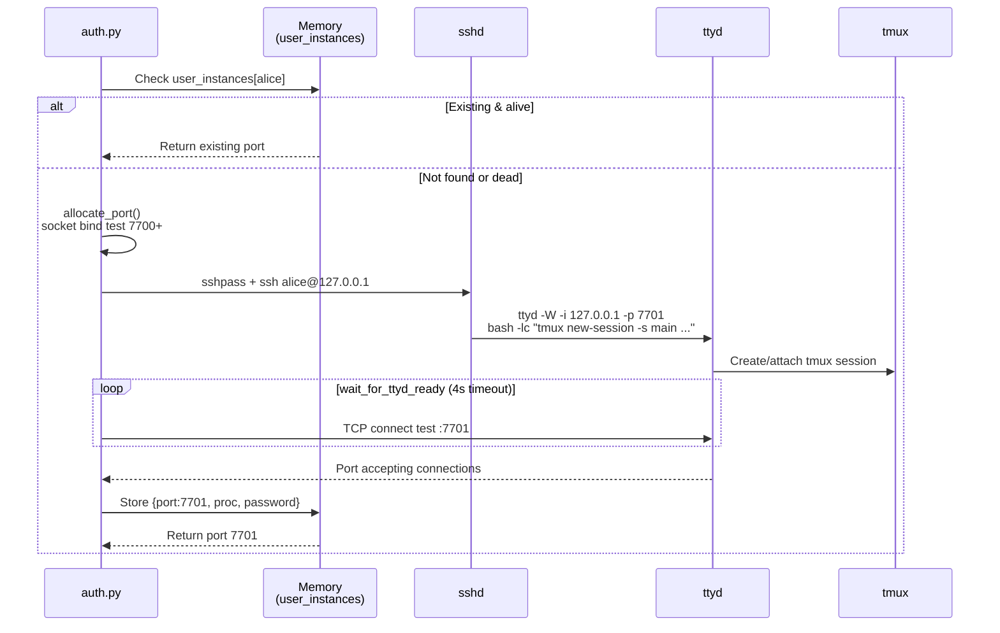

### 6.3 Port Allocation

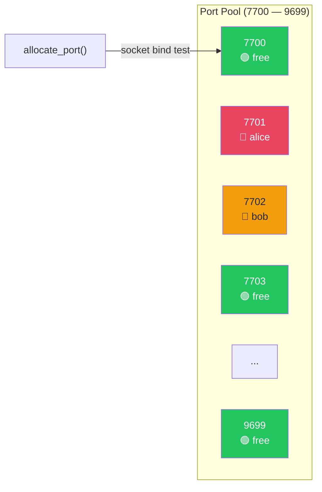

- **2000 port slots** (7700–9699)
- Allocated sequentially with **socket bind test** to verify availability
- Tracked in-memory: `user_instances[username] = {port, proc, password}`
- Reused if the process is still alive on return visits

---

## 7. Reverse Proxy & Routing Layer

### 7.1 nginx Route Map

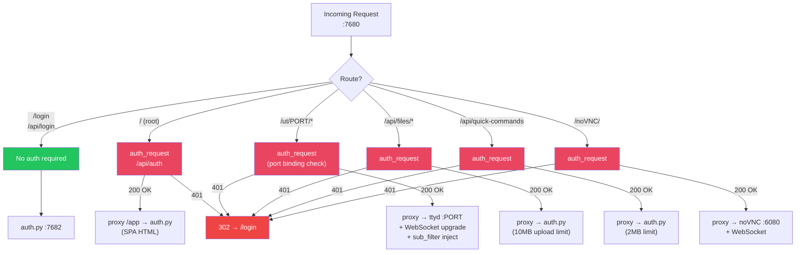

### 7.2 Key nginx Features Used

| Feature | How It's Used |
|---------|--------------|
| `auth_request` | Every protected route delegates auth to `auth.py /api/auth` |
| `proxy_pass` with regex capture | `/ut/(\d+)/(.*)` → dynamic port routing to per-user ttyd |
| `proxy_set_header Upgrade/Connection` | WebSocket upgrade for ttyd and noVNC |
| `sub_filter` | Injects `<script src="/api/term-hook.js">` into ttyd HTML response |
| `proxy_set_header X-TTYD-Port` | Passes the requested port to auth.py for cross-validation |
| `proxy_set_header Accept-Encoding ""` | Disables upstream compression so sub_filter can operate |
| `proxy_read_timeout 86400s` | 24h timeout for long-lived WebSocket connections |
| `absolute_redirect off` | Relative redirects (critical behind Cloudflare tunnel) |
| `error_page 401 = @login_redirect` | 401 → 302 /login (user-friendly redirect) |

---

## 8. Frontend SPA Architecture

### 8.1 DOM Hierarchy

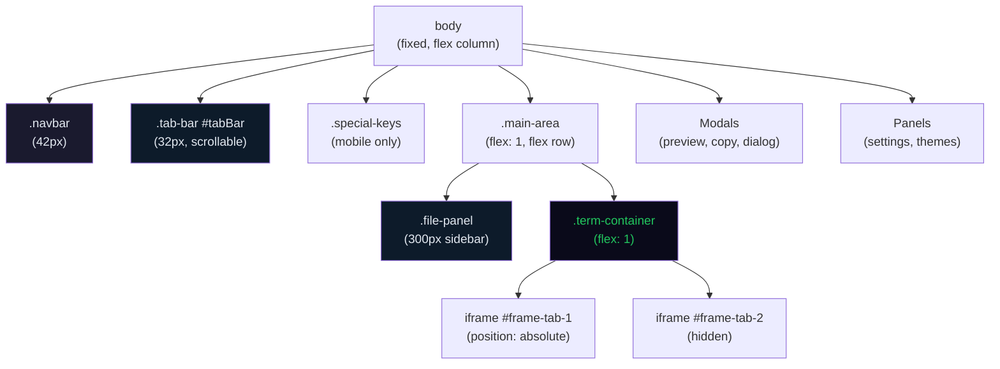

### 8.2 Tab & Split Pane Model

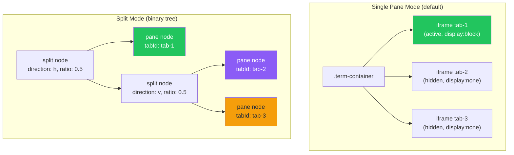

**Split Pane Data Structure:** Binary tree where each node is either:
- `{type: 'pane', tabId: 'tab-N'}` — a terminal pane
- `{type: 'split', direction: 'h'|'v', ratio: 0.5, children: [node, node]}` — a split container

**Responsive Rules:**

| Breakpoint | Behavior |
|------------|----------|
| < 768px (phone) | No split — tabs only |
| 768–1023px (tablet) | Max 2 panes, no nesting |
| ≥ 1024px (desktop) | Full nesting support |

### 8.3 Client-Side State

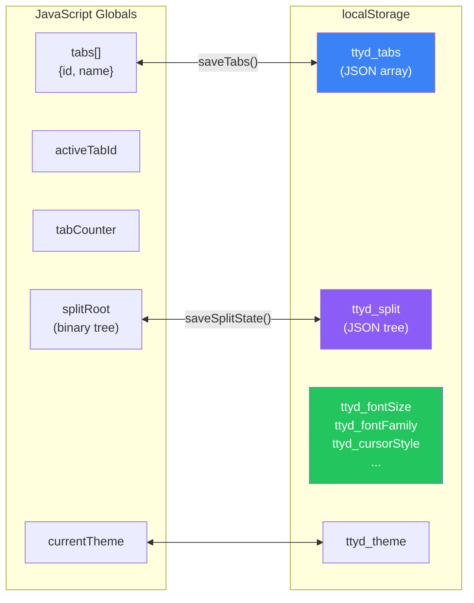

### 8.4 Keyboard Shortcuts

| Shortcut | Action | Category |
|----------|--------|----------|
| `Ctrl+Shift+T` | New Tab | Tabs |
| `Ctrl+Shift+W` | Close Tab | Tabs |
| `Ctrl+Shift+]` | Next Tab | Tabs |
| `Ctrl+Shift+[` | Previous Tab | Tabs |
| `Ctrl+Shift+\` | Split Right | Split |
| `Ctrl+Shift+-` | Split Down | Split |
| `Ctrl+Shift+U` | Unsplit | Split |
| `Ctrl+Shift+E` | Toggle File Browser | Files |
| `Escape` | Close Modals | UI |

---

## 9. File Browser Subsystem

### 9.1 Path Token Security

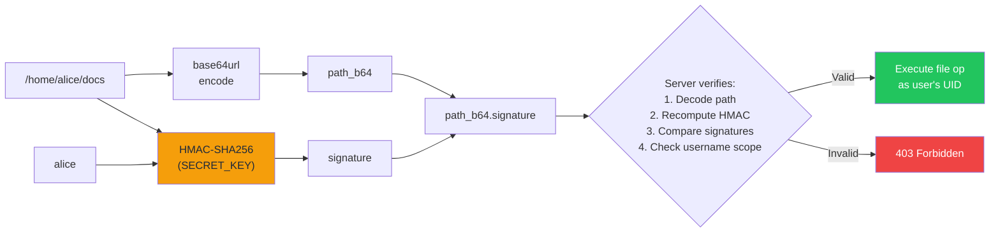

**Why path tokens?** Prevents directory traversal attacks. The client never sends raw paths — only opaque, signed tokens. Tokens are username-scoped: alice's tokens don't work for bob.

### 9.2 File API Endpoints

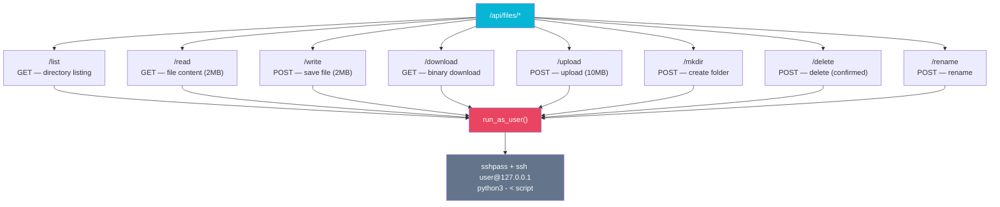

### 9.3 File Preview Support

| File Type | Preview Method |
|-----------|---------------|
| Text files | Syntax-highlighted editor (inline editable) |
| Markdown (.md) | Rendered HTML with source toggle |
| Images | Embedded in modal |
| Video / Audio | HTML5 media player |
| PDF | Embedded viewer |

---

## 10. Security Architecture

### 10.1 Defense-in-Depth Layers

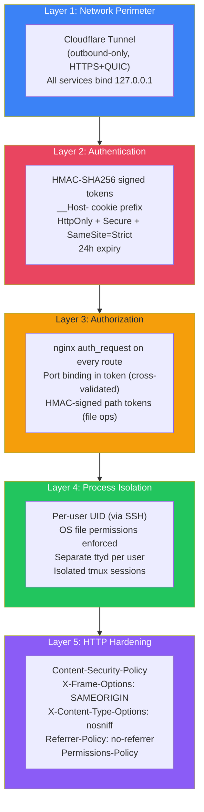

### 10.2 Threat Mitigation Matrix

| Threat | Attack Vector | Mitigation |
|--------|--------------|------------|
| **Network exposure** | Port scanning, direct access | All services bind 127.0.0.1; tunnel is outbound-only |
| **Credential theft** | Brute force | PAM rate limiting via sshd; HTTPS only |
| **Session hijacking** | Cookie theft via XSS | HttpOnly + Secure + SameSite=Strict + __Host- prefix |
| **Cross-user access** | Guessing another user's ttyd port | Token includes port; nginx cross-validates via X-TTYD-Port |
| **Directory traversal** | Manipulated file paths | HMAC-signed path tokens (per-user scoped) |
| **Privilege escalation** | File ops with wrong UID | All operations run via `run_as_user()` SSH (OS-level enforcement) |
| **XSS** | Injected scripts | Content-Security-Policy headers |
| **CSRF** | Cross-site form submission | SameSite=Strict cookies |
| **Supply chain** | Compromised dependencies | Zero external Python dependencies (stdlib only) |
| **Framing attacks** | Embedding in malicious site | X-Frame-Options: SAMEORIGIN |

---

## 11. Deployment & Operations

### 11.1 Deployment Pipeline

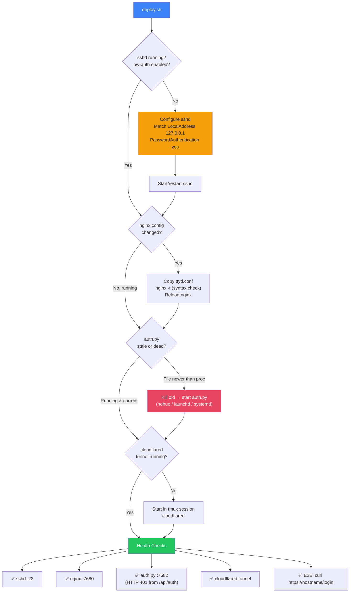

### 11.2 Platform Support

| Platform | auth.py Management | nginx | cloudflared |
|----------|-------------------|-------|-------------|
| **macOS** | launchd plist (LaunchAgent) | Homebrew service | tmux session |
| **Linux + systemd** | systemd user service | systemctl reload | tmux session |
| **Linux (no systemd / WSL2)** | nohup + PID file | service nginx reload | tmux session |

### 11.3 Operations Commands

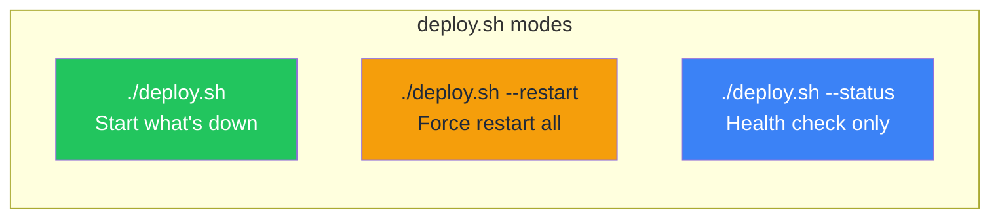

### 11.4 File Sync Requirement

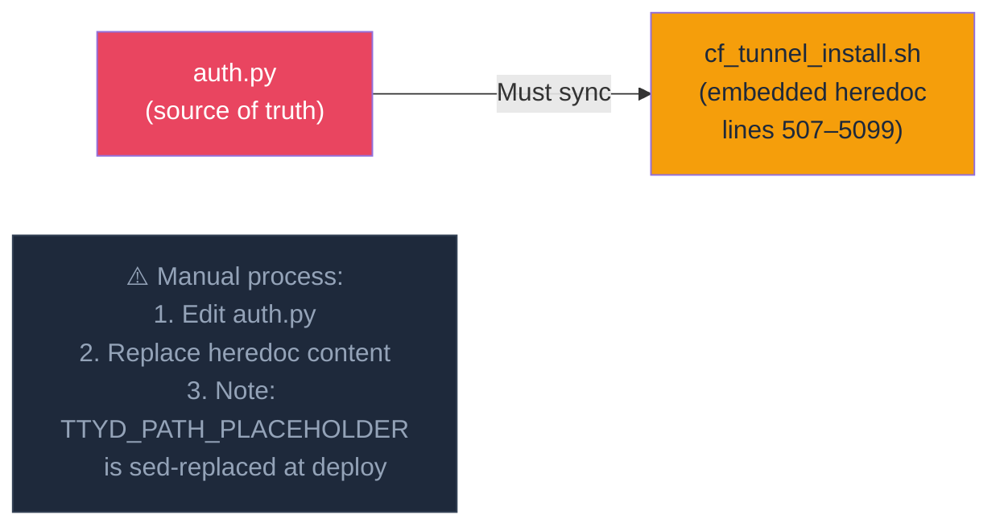

---

## 12. Data Persistence Model

```mermaid
graph TD
    subgraph "Server-Side (Ephemeral)"
        MEM["Process Memory<br/>• user_instances {port, proc, pw}<br/>• SECRET_KEY (if not in .env)"]
        FILE_CMD["~/ttyd_quick_command.json<br/>• Quick commands library"]
        TUNNEL["~/.cloudflared/<br/>• Tunnel credentials<br/>• config.yml"]
    end

    subgraph "Client-Side (Browser)"
        LS["localStorage<br/>• ttyd_tabs (tab state)<br/>• ttyd_split (split tree)<br/>• ttyd_fontSize, ttyd_fontFamily...<br/>• ttyd_theme"]
        COOKIE["Cookie<br/>• __Host-ttyd_session"]
    end

    subgraph "Lifetime"
        MEM -.->|"Lost on restart"| RESTART["⚠️ All sessions invalidated"]
        FILE_CMD -.->|"Permanent"| PERM["✅ Survives restart"]
        TUNNEL -.->|"Permanent"| PERM
        LS -.->|"Per-browser permanent"| PERM
        COOKIE -.->|"24h expiry"| EXPIRE["🕐 Auto-expires"]
    end

    style RESTART fill:#ef4444,color:#fff
    style PERM fill:#22c55e,color:#fff
    style EXPIRE fill:#f59e0b,color:#1e293b
```

---

## 13. Cross-Cutting Concerns

### 13.1 Mobile Responsiveness

```mermaid
graph TD
    WIDTH{"Screen Width"}
    WIDTH -->|"≤ 600px"| PHONE["Phone Mode<br/>• Hamburger menu<br/>• Special keys toolbar<br/>• No split panes"]
    WIDTH -->|"601–767px"| SMALL["Small Tablet<br/>• Full nav<br/>• No split panes"]
    WIDTH -->|"768–1023px"| TABLET["Tablet<br/>• Max 2 split panes<br/>• No nesting"]
    WIDTH -->|"≥ 1024px"| DESKTOP["Desktop<br/>• Full split nesting<br/>• All features"]

    TOUCH{"Touch Device?<br/>(pointer: coarse)"}
    TOUCH -->|"Yes"| MOBILE_UX["• Special keys bar visible<br/>• Touch copy modal<br/>• DOM renderer for selection<br/>• File action buttons always visible"]
    TOUCH -->|"No"| DESKTOP_UX["• Keyboard shortcuts<br/>• Native selection<br/>• Hover-reveal actions"]

    style PHONE fill:#e94560,color:#fff
    style TABLET fill:#f59e0b,color:#1e293b
    style DESKTOP fill:#22c55e,color:#fff
```

### 13.2 Session Persistence via tmux

```mermaid
graph LR
    subgraph "Browser Tab 1"
        WS1["WebSocket"]
    end
    subgraph "Browser Tab 2"
        WS2["WebSocket"]
    end

    subgraph "ttyd (single port per user)"
        TTYD["ttyd :7701"]
    end

    subgraph "tmux (persistence layer)"
        MAIN["session: main"]
        G1["grouped session 1<br/>(auto-created)"]
        G2["grouped session 2<br/>(auto-created)"]
        W0["window 0"]
        W1["window 1"]
    end

    WS1 --> TTYD
    WS2 --> TTYD
    TTYD --> G1
    TTYD --> G2
    G1 --> MAIN
    G2 --> MAIN
    MAIN --> W0
    MAIN --> W1

    CLOSE["Browser closed"] -.->|"tmux sessions<br/>keep running"| MAIN
    REOPEN["Browser reopened"] -.->|"Reattach to<br/>existing windows"| MAIN

    style TTYD fill:#8b5cf6,color:#fff
    style MAIN fill:#64748b,color:#fff
    style CLOSE fill:#ef4444,color:#fff
    style REOPEN fill:#22c55e,color:#fff
```

### 13.3 Configuration Reference

| Variable | Default | Description |
|----------|---------|-------------|
| `TTYD_SECRET` | Random per restart | HMAC signing key (set in `.env` for persistence) |
| `SESSION_MAX_AGE` | 86400 (24h) | Token validity in seconds |
| `AUTH_PORT` | 7682 | Auth service listen port |
| `TTYD_START_PORT` | 7700 | First port for user ttyd instances |
| `SESSION_COOKIE_NAME` | `__Host-ttyd_session` | HTTP cookie name |
| `COOKIE_SECURE` | true | Require HTTPS for cookies |
| `ACCESS_LOG_ENABLED` | false | Enable HTTP request logging |
| `TTYD_BIN` | auto-detect | Override ttyd binary path |
| `SSHPASS_BIN` | auto-detect | Override sshpass binary path |
| `SSH_BIN` | auto-detect | Override ssh binary path |

---

> **Document Conventions:** All Mermaid diagrams are renderable in GitHub, GitLab, Notion, and VS Code with the Markdown Preview Mermaid extension.
